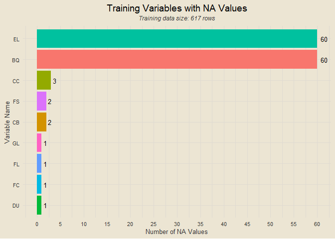
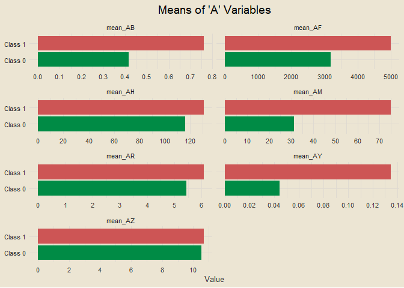
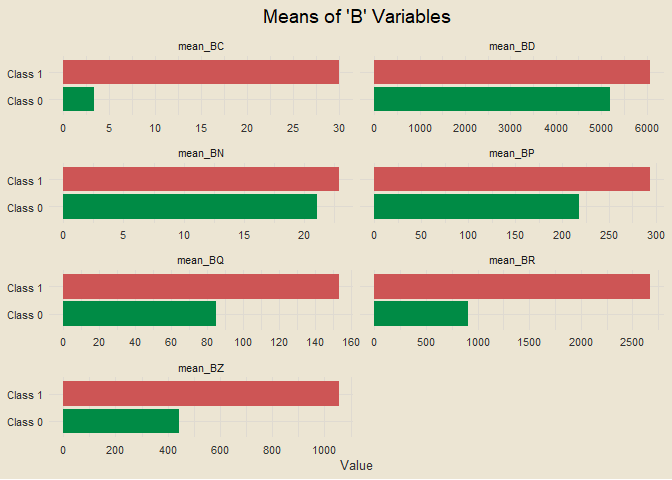
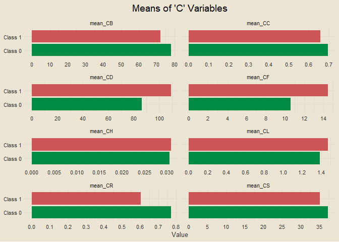
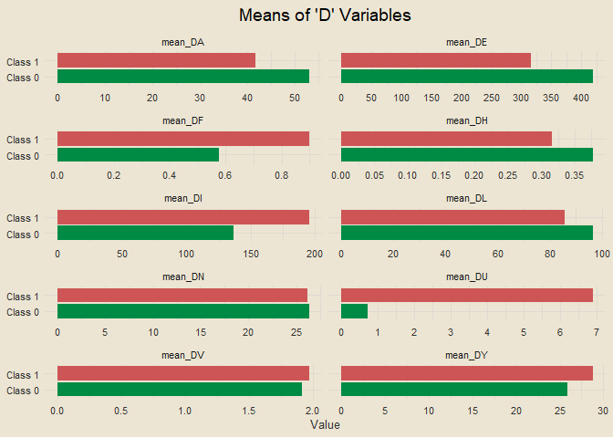
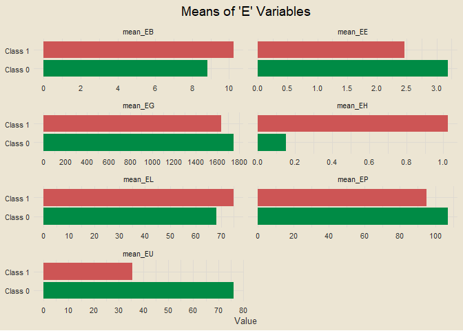
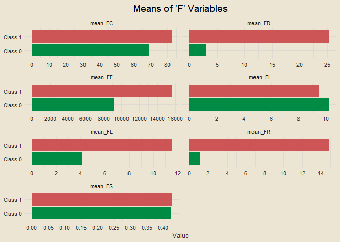
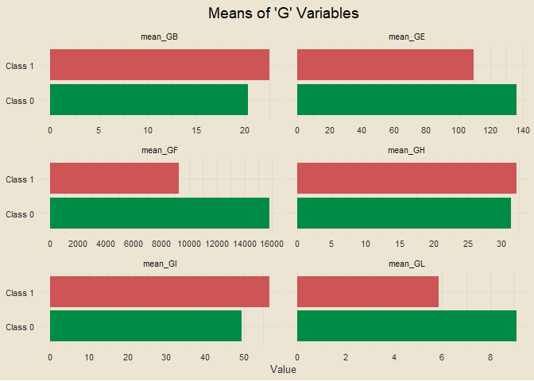
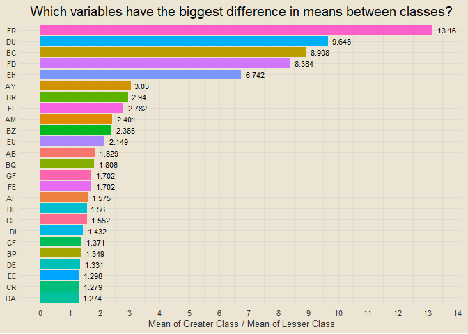

ICR - Identifying Age-Related Conditions
================
Chad Allison \| 31 July 2023

------------------------------------------------------------------------

### Introduction

The goal of this analysis is to predict if a person has any of three
medical conditions. We will be predicting if a person has one or more of
these three conditions (Class 1), or if a person has none of the three
medical conditions (Class 0). We will create this model using anonymized
measurements of health characteristics.

### Importing Packages and Setting Preferences

<details>
<summary>
View Code
</summary>

``` r
library(tidyverse) # essential functions
library(tvthemes) # for ggplot themes
library(janitor) # clean_names() function
library(tidymodels) # for modeling
library(vip) # variable importance

# creating my custom ggplot theme
theme_custom = theme_avatar() +
  theme(plot.title = element_text(hjust = 0.5),
        plot.subtitle = element_text(hjust = 0.5, size = 9, vjust = 2.5, face = "italic"),
        plot.caption = element_text(face = "italic"),
        panel.grid.major = element_line(linewidth = 0.5, colour = "#DFDAD1"),
        panel.grid.minor = element_line(linewidth = 0.5, colour = "#DFDAD1"))

theme_set(theme_custom) # setting my custom theme as default
print("Packages imported successfully")
```

</details>

    ## [1] "Packages imported successfully"

### Data Import

<details>
<summary>
View Code
</summary>

``` r
train = read_csv("data/train.csv", col_types = cols())
greeks = read_csv("data/greeks.csv", col_types = cols())
test = read_csv("data/test.csv", col_types = cols())
sample_submission = read_csv("data/sample_submission.csv", col_types = cols())
print("Data imported successfully")
```

</details>

    ## [1] "Data imported successfully"

### Training Data

<details>
<summary>
View Code
</summary>

``` r
train |>
  is.na() |>
  colSums() |>
  as_tibble() |>
  transmute(variable = names(train), NAs = as.integer(value)) |>
  filter(NAs > 0) |>
  ggplot(aes(reorder(variable, NAs), NAs)) +
  geom_col(aes(fill = variable), show.legend = F) +
  geom_text(aes(label = NAs), size = 3.5, hjust = -0.5) +
  coord_flip() +
  labs(x = "Variable Name", y = "Number of NA Values",
       title = "Training Variables with NA Values",
       subtitle = paste0("Training data size: ", nrow(train), " rows")) +
  scale_y_continuous(breaks = seq(0, 100, by = 5))
```

</details>

<!-- -->

Both the *EL* and *BQ* variables have 60 *NA* values, which amounts to
nearly 10% of the data set. We have a few other variables with a few
*NA* values as well. We have 131 *NA* values in the full training data
which amounts to only 0.366% of the total data. We will address this
before modeling.

### Examing *EJ* Variable

<details>
<summary>
View Code
</summary>

``` r
train |>
  count(EJ) |>
  mutate(pct = round(n / sum(n), 3)) |>
  arrange(desc(n))
```

</details>

    ## # A tibble: 2 × 3
    ##   EJ        n   pct
    ##   <chr> <int> <dbl>
    ## 1 B       395  0.64
    ## 2 A       222  0.36

*EJ* is our only categorical health characteristic variable, which takes
the values “A” and “B”. It takes the value “B” 64% of the time and “A”
36% of the time. Let’s look at how frequently subjects have one of the
age-related conditions for these classes.

<details>
<summary>
View Code
</summary>

``` r
train |>
  group_by(EJ) |>
  summarise(rate = round(sum(Class) / n(), 3))
```

</details>

    ## # A tibble: 2 × 2
    ##   EJ     rate
    ##   <chr> <dbl>
    ## 1 A     0.126
    ## 2 B     0.203

Nothing too glaring. Members of class “B” have one of the conditions at
a 20.3% rate and members of class “A” have one of the conditions at a
12.6% rate. Certainly different rates, but nothing too monumental. Now
we will look at the “A” variables.

### Examining “A” Variables

<details>
<summary>
View Code
</summary>

``` r
train |>
  group_by(Class) |>
  summarise(mean_AB = mean(AB),
            mean_AF = mean(AF),
            mean_AH = mean(AH),
            mean_AM = mean(AM),
            mean_AR = mean(AX),
            mean_AY = mean(AY),
            mean_AZ = mean(AZ)) |>
  pivot_longer(!Class, names_to = "measure", values_to = "value") |>
  mutate(Class = ifelse(Class == 1, "Class 1", "Class 0")) |>
  ggplot(aes(Class, value)) +
  geom_col(aes(fill = Class), show.legend = F) +
  scale_fill_manual(values = c("springgreen4", "indianred3")) +
  coord_flip() +
  facet_wrap(vars(measure),
             scales = "free_x",
             nrow = 4) +
  scale_y_continuous(breaks = scales::pretty_breaks(n = 7)) +
  labs(x = NULL, y = "Value",
       title = "Means of 'A' Variables")
```

</details>

<!-- -->

Looking at this, the “A” variables with the biggest differences appear
to be *AY*, *AM*, and *AB*. Now we will look at the “B” variables.

### Examining “B” Variables

<details>
<summary>
View Code
</summary>

``` r
train |>
  group_by(Class) |>
  summarise(mean_BC = mean(BC),
            mean_BD = mean(BD),
            mean_BN = mean(BN),
            mean_BP = mean(BP),
            mean_BQ = mean(BQ, na.rm = T),
            mean_BR = mean(BR),
            mean_BZ = mean(BZ)) |>
  pivot_longer(!Class, names_to = "measure", values_to = "value") |>
  mutate(Class = ifelse(Class == 1, "Class 1", "Class 0")) |>
  ggplot(aes(Class, value)) +
  geom_col(aes(fill = Class), show.legend = F) +
  scale_fill_manual(values = c("springgreen4", "indianred3")) +
  coord_flip() +
  facet_wrap(vars(measure),
             scales = "free_x",
             nrow = 4) +
  scale_y_continuous(breaks = scales::pretty_breaks(n = 7)) +
  labs(x = NULL, y = "Value",
       title = "Means of 'B' Variables")
```

</details>

<!-- -->

The “B” variables with the biggest difference in average value among the
two classes appear to be *BC*, *BR*, and *BZ*. Note that before moving
into modeling, we will quantify these differences instead of just
looking at them visually. Let’s move onto the “C” variables.

### Examining “C” Variables

<details>
<summary>
View Code
</summary>

``` r
train |>
  group_by(Class) |>
  summarise(mean_CB = mean(CB, na.rm = T),
            mean_CC = mean(CC, na.rm = T),
            mean_CD = mean(CD),
            mean_CF = mean(CF),
            mean_CH = mean(CH),
            mean_CL = mean(CL),
            mean_CR = mean(CR),
            mean_CS = mean(CS)) |>
  pivot_longer(!Class, names_to = "measure", values_to = "value") |>
  mutate(Class = ifelse(Class == 1, "Class 1", "Class 0")) |>
  ggplot(aes(Class, value)) +
  geom_col(aes(fill = Class), show.legend = F) +
  scale_fill_manual(values = c("springgreen4", "indianred3")) +
  coord_flip() +
  facet_wrap(vars(measure),
             scales = "free_x",
             nrow = 4) +
  scale_y_continuous(breaks = scales::pretty_breaks(n = 7)) +
  labs(x = NULL, y = "Value",
       title = "Means of 'C' Variables")
```

</details>

<!-- -->

The differences aren’t that big for these “C” variables. The biggest
differences appear to be for *CF*, *CD*, and *CR*. Let’s move on to the
“D” variables.

### Examining “D” Variables

<details>
<summary>
View Code
</summary>

``` r
train |>
  group_by(Class) |>
  summarise(mean_DA = mean(DA),
            mean_DE = mean(DE),
            mean_DF = mean(DF),
            mean_DH = mean(DH),
            mean_DI = mean(DI),
            mean_DL = mean(DL),
            mean_DN = mean(DN),
            mean_DU = mean(DU, na.rm = T),
            mean_DV = mean(DV),
            mean_DY = mean(DY)) |>
  pivot_longer(!Class, names_to = "measure", values_to = "value") |>
  mutate(Class = ifelse(Class == 1, "Class 1", "Class 0")) |>
  ggplot(aes(Class, value)) +
  geom_col(aes(fill = Class), show.legend = F) +
  scale_fill_manual(values = c("springgreen4", "indianred3")) +
  coord_flip() +
  facet_wrap(vars(measure),
             scales = "free_x",
             nrow = 5) +
  scale_y_continuous(breaks = scales::pretty_breaks(n = 7)) +
  labs(x = NULL, y = "Value",
       title = "Means of 'D' Variables")
```

</details>

<!-- -->

The “D” variables with the biggest differences appear to be *DU* (by
far), *DF*, and *DI*. Let’s move onto the “E” variables.

### Examining “E” Variables

<details>
<summary>
View Code
</summary>

``` r
train |>
  group_by(Class) |>
  summarise(mean_EB = mean(EB),
            mean_EE = mean(EE),
            mean_EG = mean(EG),
            mean_EH = mean(EH),
            mean_EL = mean(EL, na.rm = T),
            mean_EP = mean(EP),
            mean_EU = mean(EU)) |>
  pivot_longer(!Class, names_to = "measure", values_to = "value") |>
  mutate(Class = ifelse(Class == 1, "Class 1", "Class 0")) |>
  ggplot(aes(Class, value)) +
  geom_col(aes(fill = Class), show.legend = F) +
  scale_fill_manual(values = c("springgreen4", "indianred3")) +
  coord_flip() +
  facet_wrap(vars(measure),
             scales = "free_x",
             nrow = 5) +
  scale_y_continuous(breaks = scales::pretty_breaks(n = 7)) +
  labs(x = NULL, y = "Value",
       title = "Means of 'E' Variables")
```

</details>

<!-- -->

The “E” variables with the biggest differences appear to be *EH*, *EU*,
and *EE*. Note that *EJ* is excluded from this plot because it is
categorical and we briefly examined it earlier. Let’s move onto our “F”
variables.

### Examining “F” Variables

<details>
<summary>
View Code
</summary>

``` r
train |>
  group_by(Class) |>
  summarise(mean_FC = mean(FC, na.rm = T),
            mean_FD = mean(FD),
            mean_FE = mean(FE),
            mean_FI = mean(FI),
            mean_FL = mean(FL, na.rm = T),
            mean_FR = mean(FR),
            mean_FS = mean(FS, na.rm = T)) |>
  pivot_longer(!Class, names_to = "measure", values_to = "value") |>
  mutate(Class = ifelse(Class == 1, "Class 1", "Class 0")) |>
  ggplot(aes(Class, value)) +
  geom_col(aes(fill = Class), show.legend = F) +
  scale_fill_manual(values = c("springgreen4", "indianred3")) +
  coord_flip() +
  facet_wrap(vars(measure),
             scales = "free_x",
             nrow = 5) +
  scale_y_continuous(breaks = scales::pretty_breaks(n = 7)) +
  labs(x = NULL, y = "Value",
       title = "Means of 'F' Variables")
```

</details>

<!-- -->

We have some pretty big differences here, with the largest appearing to
be *FR*, *FD*, and *FL*. Now we can move on to our final set of
variables, the “G” variables.

### Examining “G” Variables

<details>
<summary>
View Code
</summary>

``` r
train |>
  group_by(Class) |>
  summarise(mean_GB = mean(GB),
            mean_GE = mean(GE),
            mean_GF = mean(GF),
            mean_GH = mean(GH),
            mean_GI = mean(GI),
            mean_GL = mean(GL, na.rm = T))  |>
  pivot_longer(!Class, names_to = "measure", values_to = "value") |>
  mutate(Class = ifelse(Class == 1, "Class 1", "Class 0")) |>
  ggplot(aes(Class, value)) +
  geom_col(aes(fill = Class), show.legend = F) +
  scale_fill_manual(values = c("springgreen4", "indianred3")) +
  coord_flip() +
  facet_wrap(vars(measure),
             scales = "free_x",
             nrow = 5) +
  scale_y_continuous(breaks = scales::pretty_breaks(n = 7)) +
  labs(x = NULL, y = "Value",
       title = "Means of 'G' Variables")
```

</details>

<!-- -->

The “G” variables with the biggest differences appear to be *GF*, *GL*,
and *GI*. Now let’s get a quantitative measure of which variables have
the biggest differences in average value between Classes.

### Variables with Biggest Differences Between Classes

<details>
<summary>
View Code
</summary>

``` r
train |>
  select(-c(Id, EJ)) |>
  pivot_longer(!Class, names_to = "variable", values_to = "value") |>
  mutate(Class = ifelse(Class == 1, "class_1", "class_0")) |>
  group_by(Class, variable) |>
  summarise(value = mean(value, na.rm = T),
            .groups = "drop") |>
  pivot_wider(names_from = "Class", values_from = "value") |>
  mutate(greater = ifelse(class_1 > class_0, class_1, class_0),
         lesser = ifelse(class_1 > class_0, class_0, class_1),
         pct_diff = greater / lesser) |>
  mutate_if(is.numeric, round, 3) |>
  slice_max(pct_diff, n = 25) |>
  ggplot(aes(reorder(variable, pct_diff), pct_diff)) +
  geom_col(aes(fill = variable), show.legend = F) +
  geom_text(aes(label = pct_diff), size = 3, hjust = -0.25) +
  coord_flip(ylim = c(0, 13.5)) +
  labs(x = NULL, y = "Mean of Greater Class / Mean of Lesser Class",
       title = "Which variables have the biggest difference in means between classes?") +
  scale_y_continuous(breaks = seq(0, 25, by = 1))
```

</details>

<!-- -->

### Missing Value Imputations

<details>
<summary>
View Code
</summary>

``` r
na_cols = train |>
  is.na() |>
  colSums() |>
  data.frame() |>
  remove_rownames() |>
  setNames("n_NA") |>
  transmute(column = names(train), n_NA) |>
  filter(n_NA > 0) |>
  pull(column)

train2 = train |>
  group_by(Class) |>
  mutate(BQ = ifelse(is.na(BQ), mean(BQ, na.rm = T), BQ),
         CB = ifelse(is.na(CB), mean(CB, na.rm = T), CB),
         CC = ifelse(is.na(CC), mean(CC, na.rm = T), CC),
         DU = ifelse(is.na(DU), mean(DU, na.rm = T), DU),
         EL = ifelse(is.na(EL), mean(EL, na.rm = T), EL),
         FC = ifelse(is.na(FC), mean(FC, na.rm = T), FC),
         FL = ifelse(is.na(FL), mean(FL, na.rm = T), FL),
         FS = ifelse(is.na(FS), mean(FS, na.rm = T), FS),
         GL = ifelse(is.na(GL), mean(GL, na.rm = T), GL)) |>
  ungroup()

sum(is.na(train2))
```

</details>

    ## [1] 0

The missing values have now been imputed with the class-wise mean for
that variable.

### Final Data Prep

<details>
<summary>
View Code
</summary>

``` r
# making sure target variable is a factor with positive class as its first level
data = train2 |>
  mutate(Class = ifelse(Class == 1, "class_1", "class_0"),
         Class = factor(Class, levels = c("class_1", "class_0")),
         EJ = factor(EJ, levels = c("A", "B")),
         Id = as.factor(Id)) |>
  clean_names() |>
  select(-id)
```

</details>

### Modeling

<details>
<summary>
View Code
</summary>

``` r
set.seed(123)
split = initial_split(data, strata = class)
df_train = training(split)
df_test = testing(split)

xgb_spec = boost_tree(
  trees = 1000,
  tree_depth = tune(),
  min_n = tune(),
  loss_reduction = tune(),
  sample_size = tune(),
  mtry = tune(),
  learn_rate = tune()
) |>
  set_engine("xgboost") |>
  set_mode("classification")

# xgb_spec

xgb_grid = grid_latin_hypercube(
  tree_depth(),
  min_n(),
  loss_reduction(),
  sample_size = sample_prop(),
  finalize(mtry(), df_train),
  learn_rate(),
  size = 30
)

# xgb_grid

xgb_wf = workflow() |>
  add_formula(class ~ .) |>
  add_model(xgb_spec)

# xgb_wf

df_folds = vfold_cv(df_train, strata = class)

# df_folds

doParallel::registerDoParallel()
# tictoc::tic()

xgb_res = tune_grid(
  xgb_wf,
  resamples = df_folds,
  grid = xgb_grid,
  control = control_grid(save_pred = T)
)

# tictoc::toc() # around 129s
doParallel::stopImplicitCluster()

# xgb_res

best_auc = select_best(xgb_res, "roc_auc")

final_xgb = finalize_workflow(
  xgb_wf,
  best_auc
)

# final_xgb |>
#   fit(data = df_train) |>
#   pull_workflow_fit() |>
#   vip(geom = "point")

final_res = last_fit(final_xgb, split)

collect_metrics(final_res)
```

</details>

    ## # A tibble: 2 × 4
    ##   .metric  .estimator .estimate .config             
    ##   <chr>    <chr>          <dbl> <chr>               
    ## 1 accuracy binary         0.948 Preprocessor1_Model1
    ## 2 roc_auc  binary         0.966 Preprocessor1_Model1

### Fitting Model on Testing Data

<details>
<summary>
View Code
</summary>

``` r
final_test = test |>
  clean_names() |>
  mutate_if(is.character, factor) |>
  select(-id)

xgb_model = final_res$.workflow[[1]]

final_predictions = predict(xgb_model, final_test, type = "prob")
```

</details>

### Writing Submission Data

<details>
<summary>
View Code
</summary>

``` r
final_predictions |>
  transmute(Id = test$Id, class_0 = .pred_class_0, class_1 = .pred_class_1) |>
  write_csv("data/final_submission.csv")
```

</details>
